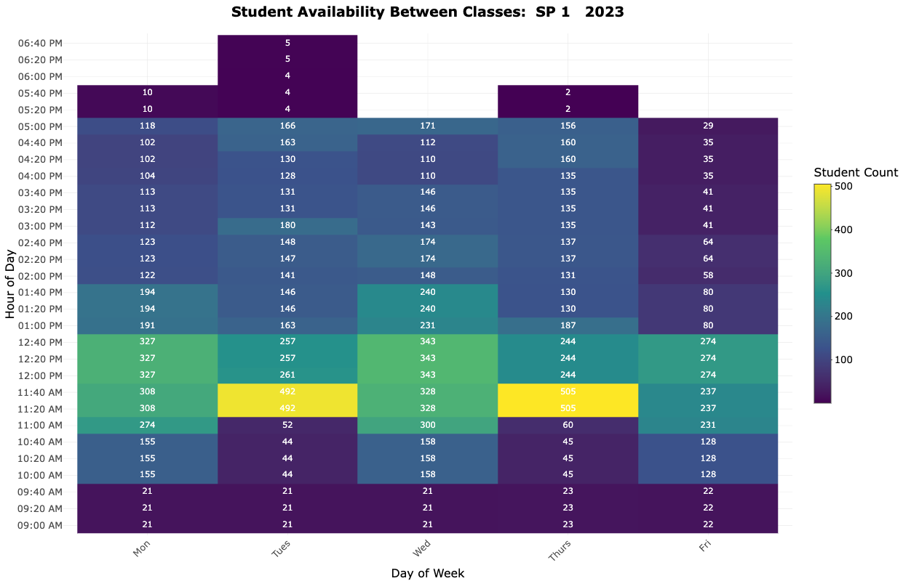

[](https://github.com/nragland37/student-time-analysis/blob/main/LICENSE)

# <p align="center"> Student Time Analysis </p>

<p align="center">
  
</p>

## Overview

This application provides an intuitive way to visualize student availability between classes using interactive heatmaps. It allows institutions to optimize class schedules and resource allocation by identifying the most common free times across various days and times.

## Features

- **Interactive Heatmap Visualization**: View student availability across different times and days.
- **Customizable Filters**: Filter data by semester term, day of the week, class level, major, concentration, department, and more.
- **Flexible Time Increments**: Adjust the maximum gap and time increment settings to suit specific analysis needs.
- **Color Palette**: Utilizes the `viridis` color palette for clear and visually accessible data representation.

## File Structure

- `global.R`: Contains global variables and functions that are shared across the UI and server components.
- `server.R`: Defines the server-side logic of the application, including data processing and reactive expressions.
- `ui.R`: Describes the user interface of the application, including layout, input controls, and visual output elements.

## Getting Started

### Prerequisites

- **R**: Ensure that R is installed on your system. You can download it from [here](https://cran.r-project.org/).
- **Shiny Package**: Install the Shiny package in R by running the following command:
  
  ```R
  install.packages("shiny")
  ```
  
- **Other Required Packages**: You may also need to install additional packages used in the scripts such as `ggplot2`, `dplyr`, `tidyverse`, etc.

### Installation

1. **Clone the repository**:
   ```bash
   git clone https://github.com/nragland37/student-time-analysis.git
   ```
2. **Navigate to the project directory**:
   ```bash
   cd student-time-analysis
   ```

3. **Run the application**:

   Open RStudio or an R environment and execute the following commands:
   ```R
   # Run the application
   runApp()
   ```

   Alternatively, you can use the following command to run the app directly from the command line:
   ```bash
   Rscript -e 'shiny::runApp()'
   ```

## Data Information

**Note:** The original student data file (`student_data.csv`) is not included in this repository to protect privacy. To run the application locally, you can create a CSV file with the following structure and sample data:

```
id, sess, yr, cl, major1_majortext, major1_conctext, crs_dept, days, beg_tm, end_tm, beg_date, end_date
123456, FA, 2023, SO, Business Administration, Finance, BUSN, --M-W-F-, 0900, 0950, 2023-01-16, 2023-05-12
234567, SP, 2023, JR, Computer Science, Cybersecurity, COSC, --T-R--, 1000, 1120, 2023-01-16, 2023-05-12
345678, SU, 2023, SR, Psychology, None assigned, PSYC, --M-W---, 1300, 1420, 2023-06-01, 2023-07-15
```

Ensure your CSV file follows this format to match the application's expected input.

